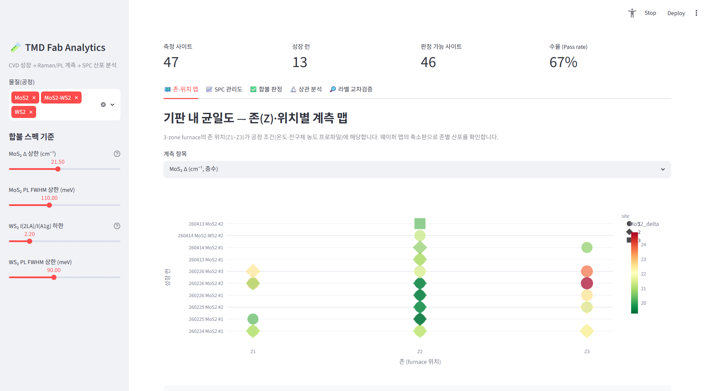
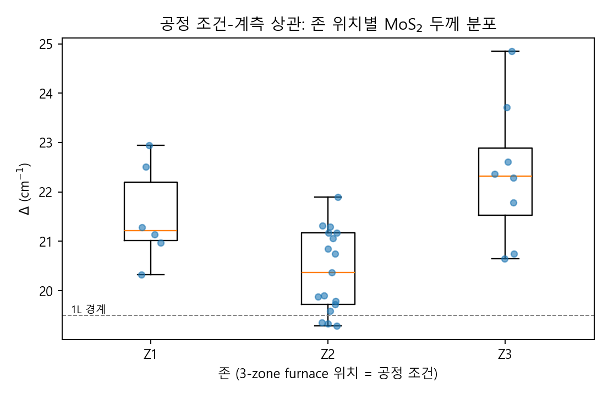
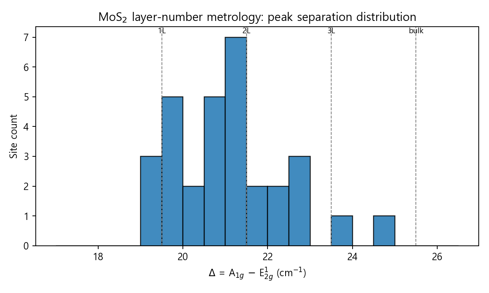
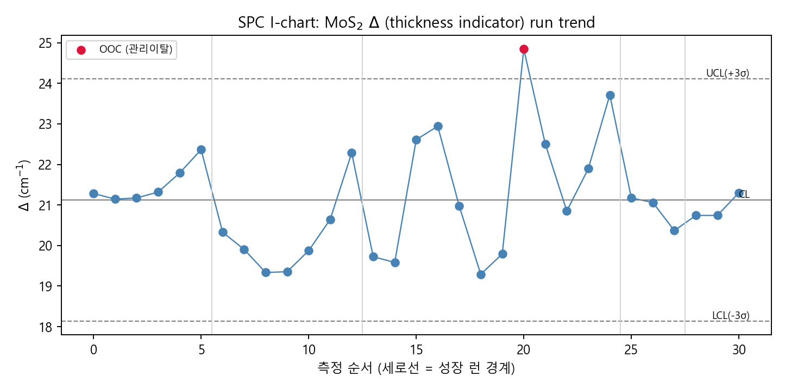
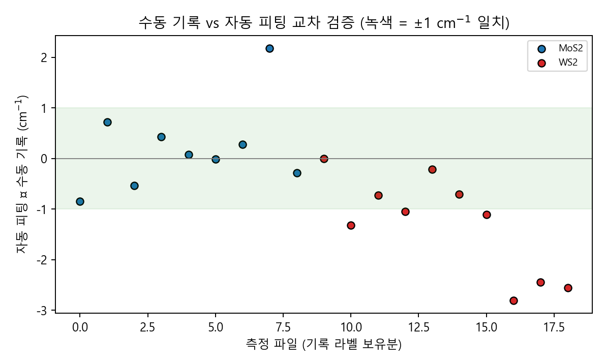

# TMD Fab Analytics — CVD 공정-계측 데이터 분석 시스템

[](https://tmd-fab-analytics.streamlit.app)

> **2D 반도체(MoS₂/WS₂) CVD 성장 공정의 Raman/PL 계측 데이터를 자동 분석하고,
> SPC(통계적 공정 관리) 관점으로 산포를 관리하는 미니 팹 계측 시스템**

**▶ 라이브 데모: [tmd-fab-analytics.streamlit.app](https://tmd-fab-analytics.streamlit.app)**



연세대학교 나노소자연구실(NDL, Nanodevice Laboratory) 학부연구생 시절
3-zone CVD로 직접 성장시킨 MoS₂/WS₂ 시료의 **실측 Raman/PL 스펙트럼 94개**를
기반으로 만들었습니다. 

반도체 공정기술 직무의 핵심 루프인
**공정 조건 → 인라인 계측 → 산포 분석 → 공정 개선**을
연구실 규모 데이터로 그대로 구현한 프로젝트입니다.

| 팹 양산 개념 | 이 프로젝트에서의 구현 |
|---|---|
| 공정 조건 (레시피/챔버 위치) | 성장 런(날짜·샘플) + 3-zone furnace 존 위치(Z1~Z3) |
| 인라인 계측 (두께·결정성) | Raman E¹₂g/A₁g 피팅 → Δ(층수), PL 피크/FWHM(광학 품질) |
| 웨이퍼 맵 / 산포 관리 | 존-위치별 계측 맵, I-chart(±3σ), Cpk |
| 합불 판정 (스펙 관리) | Δ·강도비·PL FWHM 기준 사이트별 Pass/Fail + 런별 수율 |
| 계측 자동화 / 휴먼에러 검출 | 수동 기록(파일명 라벨) vs 자동 피팅 교차 검증 |

---

## 시스템 구성

```
data/          # 실측 raw 스펙트럼 (탭 구분 txt, 94개)
src/
  spectra.py   # 로딩·despike·Lorentzian 피팅 (+품질 게이트)
  pipeline.py  # 일괄 계측: 파일명 파싱 → 피팅 → summary 테이블
  spc.py       # I-chart 관리한계선, Cpk, 합불 판정
  config.py    # 피크 탐색 구간·층수 기준·스펙 정의
app/
  dashboard.py # Streamlit 대시보드 (5개 탭)
scripts/
  make_figures.py  # README용 대표 그림 재생성
output/        # summary.csv / summary.xlsx (자동 생성)
```

### 1단계 — 자동 계측 파이프라인

Raw 스펙트럼 → cosmic-ray 제거 → **Lorentzian + 선형배경 피팅** →
Si 520.7 cm⁻¹ 기준 축 보정 → 물질별 지표 산출.

- **MoS₂**: Δ = A₁g − E¹₂g 로 층수 판정 (Δ<19.5 → 1L). 데이터 그리드 간격이
  ~0.86 cm⁻¹라 argmax가 아닌 함수 피팅으로 서브그리드 정밀도를 확보.
- **WS₂**: 532 nm 공명 조건의 I(2LA)/I(A₁g) 강도비로 1L 판정 (>2.2 → 1L).
- **PL**: A exciton 피크 에너지·강도·FWHM(meV) — 직접천이 여부(층수)와 광학 품질.
- **피팅 품질 게이트**: 중심이 탐색 구간 경계에 붙거나 FWHM이 그리드 간격
  수준인 스파이크 오피팅을 자동 기각 → 피크가 없는 시료가 "그럴듯한 숫자"로
  둔갑하는 것을 방지.

```bash
python -m src.pipeline        # → output/summary.csv, summary.xlsx
```

### 2단계 — SPC 대시보드

```bash
streamlit run app/dashboard.py
```

| 탭 | 내용 |
|---|---|
| 🗺️ 존-위치 맵 | 존(Z1~Z3)·위치별 계측값 히트맵 — 기판 내/존 간 균일도 |
| 📈 SPC 관리도 | 런 순서 I-chart, MR 기반 ±3σ 관리한계선, OOC 검출, Cpk |
| ✅ 합불 판정 | 스펙 기준(사이드바에서 실시간 조정) 사이트별 Pass/Fail, 런별 수율 |
| 🔬 상관 분석 | 존 위치→층수 one-way ANOVA, Raman↔PL 정합성 (Pearson r) |
| 🔎 라벨 교차검증 | 수동 기록 vs 자동 피팅 비교 — 기록 오류 후보 자동 플래그 |

### 3단계 — 공정 조건 상관 분석 (데이터 기반)

존 위치(공정 조건)가 성장 결과(층수)에 미치는 효과를 통계적으로 검정합니다.



Z2(중앙 존)가 평균 Δ가 가장 낮고 산포도 가장 작아 **1~2L 성장의 최적 위치**임이
데이터로 확인됩니다. Z1은 산포가 커서 공정 개선 1순위 대상입니다.

---

## 주요 결과

### 층수 계측 분포 (MoS₂, Δ 기준)



### SPC 관리도 — 런별 두께 트렌드



### 계측 자동화가 잡아낸 수동 기록 오류

측정 당시 Origin에서 커서로 읽어 파일명에 기록한 피크값과 자동 피팅을
전수 비교한 결과, **19건 중 7건이 1 cm⁻¹ 이상 불일치**했습니다.



대표 사례: `260220 WS2 #1 Z2-2 Raman (419.55).txt` — 수동 기록은 A₁g=419.55였으나
raw 데이터의 실제 피크는 416.9~417.7 cm⁻¹ 구간에 있어 **기록 쪽 오류**로 확인.
그리드 간격(0.86 cm⁻¹)보다 큰 차이는 수동 판독의 휴먼 에러이며,
계측 자동화가 데이터 신뢰성을 어떻게 높이는지 보여주는 실증 사례입니다.

---

## 물리적 배경 (요약)

- **MoS₂ Raman**: E¹₂g(~385 cm⁻¹, 면내) / A₁g(~405 cm⁻¹, 면외). 층수가 늘면
  E¹₂g는 연화, A₁g는 경화 → 간격 Δ가 층수 지표 (1L ≈ 18–19.5 cm⁻¹).
- **WS₂ Raman**: 532 nm 여기에서 2LA(M) 모드가 공명 증강되어 E¹₂g(~356 cm⁻¹)와
  중첩. I(2LA)/I(A₁g) 비가 1L에서 급증.
- **PL**: 1L에서 직접 밴드갭(MoS₂ ~1.88 eV, WS₂ ~2.02 eV) → 강한 A exciton 발광.
  2L 이상은 간접천이로 강도 급감. FWHM은 결정 품질·도핑·변형의 지표.
- **Si 520.7 cm⁻¹**: 분광기 축 보정 및 강도 정규화 기준.

## 실행 방법

```bash
git clone https://github.com/yoontf0/tmd-fab-analytics.git
cd tmd-fab-analytics
pip install -r requirements.txt
python -m src.pipeline               # 계측 파이프라인
streamlit run app/dashboard.py       # 대시보드
python scripts/make_figures.py       # README 그림 재생성
```

새 측정 데이터는 `data/` 아래에 폴더째 넣으면 됩니다.
파일명 규칙: `YYMMDD 물질 #샘플 Z존-위치 Raman|PL (라벨).txt`

## 기술 스택

Python · NumPy/SciPy(피크 피팅) · pandas · Streamlit + Plotly(대시보드) · matplotlib

## 데이터 출처

연세대학교 NDL(Nanodevice Laboratory)에서 학부연구생으로 직접 수행한
3-zone CVD MoS₂/WS₂ 성장 및 Raman/PL 측정 데이터 (2026.02–2026.04).
연구실의 관련 연구:
*ACS Appl. Mater. Interfaces* 2026, 18, 12132−12142 ·
*Appl. Surf. Sci.* 642 (2024) 158566
